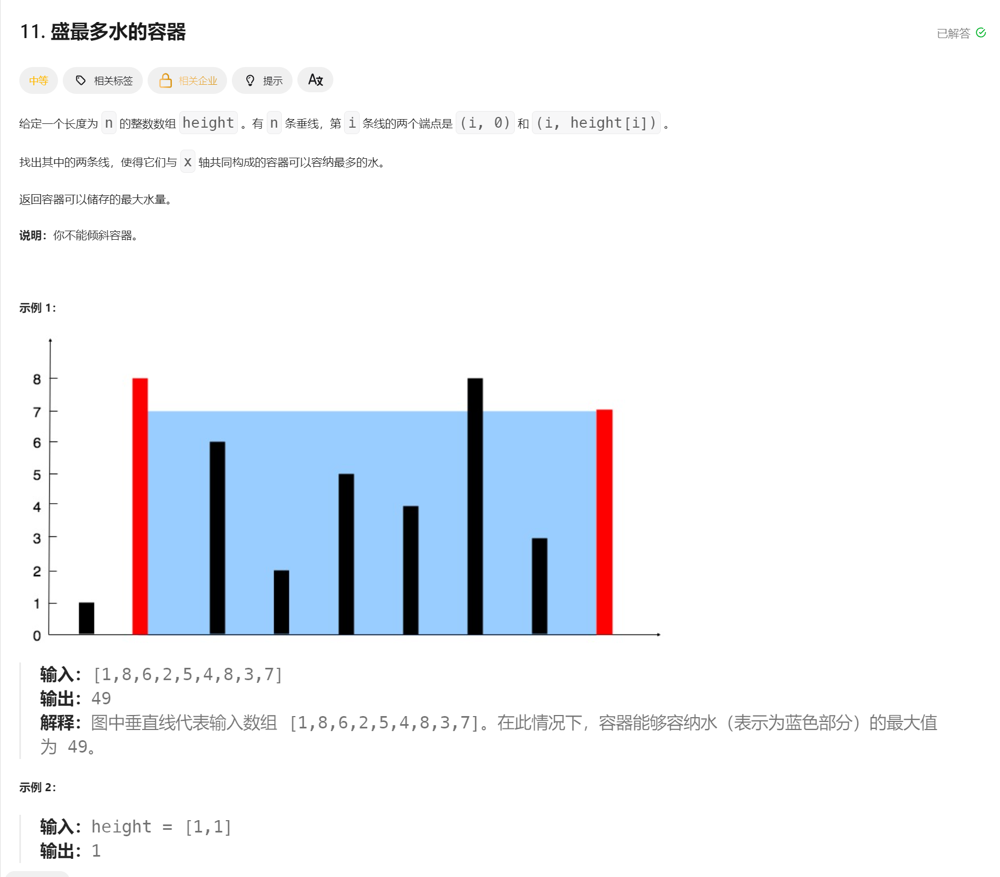

# 4.1.2 数组专题(6-10题)-Java版本

# 4.1.2 数组专题(6-10题) - Java版本
> 本文档包含LeetCode热题100中数组专题的第6-10道题目，提供基础解法和进阶优化版本
>

---

## 📊 题目概览
| 题号 | 题目 | 难度 | 标签 |
| --- | --- | --- | --- |
| 11 | 盛最多水的容器 | 🟡 中等 | 贪心, 数组, 双指针 |
| 15 | 三数之和 | 🟡 中等 | 数组, 双指针, 排序 |
| 33 | 搜索旋转排序数组 | 🟡 中等 | 数组, 二分查找 |
| 34 | 在排序数组中查找元素的第一个和最后一个位置 | 🟡 中等 | 数组, 二分查找 |
| 55 | 跳跃游戏 | 🟡 中等 | 贪心, 数组, 动态规划 |


---

## 1️⃣ 盛最多水的容器 (LeetCode 11)
### 📝 题目描述
给定一个长度为 `n` 的整数数组 `height`。有 `n` 条垂线，第 `i` 条线的两个端点是 `(i, 0)` 和 `(i, height[i])`。

找出其中的两条线，使得它们与 x 轴共同构成的容器可以容纳最多的水。

返回容器可以储存的最大水量。

**说明：** 你不能倾斜容器。

**示例 1：**

```plain
输入：[1,8,6,2,5,4,8,3,7]
输出：49 
解释：图中垂直线代表输入数组 [1,8,6,2,5,4,8,3,7]。在此情况下，容器能够容纳水（表示为蓝色部分）的最大值为 49。
```

**示例 2：**

```plain
输入：height = [1,1]
输出：1
```



### 🔧 基础解法：暴力枚举
```java
class Solution {
    public int maxArea(int[] height) {
        int maxArea = 0;
        
        // 枚举所有可能的两条线
        for (int i = 0; i < height.length; i++) {
            for (int j = i + 1; j < height.length; j++) {
                // 计算面积：宽度 × 最小高度
                int width = j - i;
                int minHeight = Math.min(height[i], height[j]);
                int area = width * minHeight;
                maxArea = Math.max(maxArea, area);
            }
        }
        
        return maxArea;
    }
}
```

**复杂度分析：**

+ 时间复杂度：O(n²)
+ 空间复杂度：O(1)

### 🚀 进阶解法：双指针
```java
class Solution {
    public int maxArea(int[] height) {
        int left = 0, right = height.length - 1;
        int maxArea = 0;
        
        while (left < right) {
            // 计算当前面积
            int width = right - left;
            int minHeight = Math.min(height[left], height[right]);
            int area = width * minHeight;
            maxArea = Math.max(maxArea, area);
            
            // 移动较短的那一边
            if (height[left] < height[right]) {
                left++;
            } else {
                right--;
            }
        }
        
        return maxArea;
    }
}
```

**复杂度分析：**

+ 时间复杂度：O(n)
+ 空间复杂度：O(1)

**解题思路：**

1. 使用双指针从两端开始
2. 每次移动较短的那一边（因为面积由短边决定）
3. 移动长边不会增加面积，移动短边可能找到更高的线

---

## 2️⃣ 三数之和 (LeetCode 15)
### 📝 题目描述
给你一个整数数组 `nums`，判断是否存在三元组 `[nums[i], nums[j], nums[k]]` 满足 `i != j`、`i != k` 且 `j != k`，同时还满足 `nums[i] + nums[j] + nums[k] == 0`。

请你返回所有和为 0 且不重复的三元组。

**注意：** 答案中不可以包含重复的三元组。

**示例 1：**

```plain
输入：nums = [-1,0,1,2,-1,-4]
输出：[[-1,-1,2],[-1,0,1]]
解释：
nums[0] + nums[1] + nums[2] = (-1) + 0 + 1 = 0 。
nums[1] + nums[2] + nums[4] = 0 + 1 + (-1) = 0 。
nums[0] + nums[3] + nums[4] = (-1) + 2 + (-1) = 0 。
不同的三元组是 [-1,0,1] 和 [-1,-1,2] 。
```

### 🔧 基础解法：暴力枚举 + 去重
```java
class Solution {
    public List<List<Integer>> threeSum(int[] nums) {
        Set<List<Integer>> resultSet = new HashSet<>();
        
        // 三重循环枚举所有可能的三元组
        for (int i = 0; i < nums.length; i++) {
            for (int j = i + 1; j < nums.length; j++) {
                for (int k = j + 1; k < nums.length; k++) {
                    if (nums[i] + nums[j] + nums[k] == 0) {
                        List<Integer> triplet = Arrays.asList(nums[i], nums[j], nums[k]);
                        Collections.sort(triplet);  // 排序以便去重
                        resultSet.add(triplet);
                    }
                }
            }
        }
        
        return new ArrayList<>(resultSet);
    }
}
```

**复杂度分析：**

+ 时间复杂度：O(n³)
+ 空间复杂度：O(n)

### 🚀 进阶解法：排序 + 双指针
```java
class Solution {
    public List<List<Integer>> threeSum(int[] nums) {
        List<List<Integer>> result = new ArrayList<>();
        Arrays.sort(nums);  // 先排序
        
        for (int i = 0; i < nums.length - 2; i++) {
            // 跳过重复的第一个数
            if (i > 0 && nums[i] == nums[i - 1]) {
                continue;
            }
            
            int left = i + 1, right = nums.length - 1;
            int target = -nums[i];
            
            while (left < right) {
                int sum = nums[left] + nums[right];
                
                if (sum == target) {
                    result.add(Arrays.asList(nums[i], nums[left], nums[right]));
                    
                    // 跳过重复的数字
                    while (left < right && nums[left] == nums[left + 1]) left++;
                    while (left < right && nums[right] == nums[right - 1]) right--;
                    
                    left++;
                    right--;
                } else if (sum < target) {
                    left++;
                } else {
                    right--;
                }
            }
        }
        
        return result;
    }
}
```

**复杂度分析：**

+ 时间复杂度：O(n²)
+ 空间复杂度：O(1)

**解题思路：**

1. 先对数组排序
2. 固定第一个数，用双指针寻找另外两个数
3. 通过跳过重复元素来避免重复结果

---

## 3️⃣ 搜索旋转排序数组 (LeetCode 33)
### 📝 题目描述
整数数组 `nums` 按升序排列，数组中的值互不相同。

在传递给函数之前，`nums` 在预先未知的某个下标 `k`（`0 <= k < nums.length`）上进行了旋转，使数组变为 `[nums[k], nums[k+1], ..., nums[n-1], nums[0], nums[1], ..., nums[k-1]]`（下标从 0 开始计数）。例如， `[0,1,2,4,5,6,7]` 在下标 `3` 处经旋转后可能变为 `[4,5,6,7,0,1,2]`。

给你旋转后的数组 `nums` 和一个整数 `target`，如果 `nums` 中存在这个目标值 `target`，则返回它的下标，否则返回 `-1`。

你必须设计一个时间复杂度为 `O(log n)` 的算法解决此问题。

**示例 1：**

```plain
输入：nums = [4,5,6,7,0,1,2], target = 0
输出：4
```

### 🔧 基础解法：线性搜索
```java
class Solution {
    public int search(int[] nums, int target) {
        // 线性搜索
        for (int i = 0; i < nums.length; i++) {
            if (nums[i] == target) {
                return i;
            }
        }
        return -1;
    }
}
```

**复杂度分析：**

+ 时间复杂度：O(n)
+ 空间复杂度：O(1)

### 🚀 进阶解法：二分查找
```java
class Solution {
    public int search(int[] nums, int target) {
        int left = 0, right = nums.length - 1;
        
        while (left <= right) {
            int mid = left + (right - left) / 2;
            
            if (nums[mid] == target) {
                return mid;
            }
            
            // 判断哪一半是有序的
            if (nums[left] <= nums[mid]) {
                // 左半部分有序
                if (target >= nums[left] && target < nums[mid]) {
                    right = mid - 1;  // target在左半部分
                } else {
                    left = mid + 1;   // target在右半部分
                }
            } else {
                // 右半部分有序
                if (target > nums[mid] && target <= nums[right]) {
                    left = mid + 1;   // target在右半部分
                } else {
                    right = mid - 1;  // target在左半部分
                }
            }
        }
        
        return -1;
    }
}
```

**复杂度分析：**

+ 时间复杂度：O(log n)
+ 空间复杂度：O(1)

**解题思路：**

1. 旋转数组的特点：必有一半是有序的
2. 判断哪一半有序，然后判断target在哪一半
3. 根据判断结果调整搜索范围

---

## 4️⃣ 在排序数组中查找元素的第一个和最后一个位置 (LeetCode 34)
### 📝 题目描述
给你一个按照非递减顺序排列的整数数组 `nums`，和一个目标值 `target`。请你找出给定目标值在数组中的开始位置和结束位置。

如果数组中不存在目标值 `target`，返回 `[-1, -1]`。

你必须设计并实现时间复杂度为 `O(log n)` 的算法解决此问题。

**示例 1：**

```plain
输入：nums = [5,7,7,8,8,10], target = 8
输出：[3,4]
```

**示例 2：**

```plain
输入：nums = [5,7,7,8,8,10], target = 6
输出：[-1,-1]
```

### 🔧 基础解法：线性搜索
```java
class Solution {
    public int[] searchRange(int[] nums, int target) {
        int first = -1, last = -1;
        
        // 线性搜索找到第一个和最后一个位置
        for (int i = 0; i < nums.length; i++) {
            if (nums[i] == target) {
                if (first == -1) {
                    first = i;  // 第一次找到
                }
                last = i;  // 更新最后一个位置
            }
        }
        
        return new int[]{first, last};
    }
}
```

**复杂度分析：**

+ 时间复杂度：O(n)
+ 空间复杂度：O(1)

### 🚀 进阶解法：二分查找
```java
class Solution {
    public int[] searchRange(int[] nums, int target) {
        int first = findFirst(nums, target);
        int last = findLast(nums, target);
        return new int[]{first, last};
    }
    
    // 查找第一个等于target的位置
    private int findFirst(int[] nums, int target) {
        int left = 0, right = nums.length - 1;
        int result = -1;
        
        while (left <= right) {
            int mid = left + (right - left) / 2;
            
            if (nums[mid] == target) {
                result = mid;
                right = mid - 1;  // 继续向左搜索
            } else if (nums[mid] < target) {
                left = mid + 1;
            } else {
                right = mid - 1;
            }
        }
        
        return result;
    }
    
    // 查找最后一个等于target的位置
    private int findLast(int[] nums, int target) {
        int left = 0, right = nums.length - 1;
        int result = -1;
        
        while (left <= right) {
            int mid = left + (right - left) / 2;
            
            if (nums[mid] == target) {
                result = mid;
                left = mid + 1;   // 继续向右搜索
            } else if (nums[mid] < target) {
                left = mid + 1;
            } else {
                right = mid - 1;
            }
        }
        
        return result;
    }
}
```

**复杂度分析：**

+ 时间复杂度：O(log n)
+ 空间复杂度：O(1)

**解题思路：**

1. 分别用二分查找找第一个和最后一个位置
2. 找第一个：找到target后继续向左搜索
3. 找最后一个：找到target后继续向右搜索

---

## 5️⃣ 跳跃游戏 (LeetCode 55)
### 📝 题目描述
给你一个非负整数数组 `nums`，你最初位于数组的第一个下标。

数组中的每个元素代表你在该位置可以跳跃的最大长度。

判断你是否能够到达最后一个下标。

**示例 1：**

```plain
输入：nums = [2,3,1,1,4]
输出：true
解释：可以先跳 1 步，从下标 0 到达下标 1, 然后再从下标 1 跳 3 步到达最后一个下标。
```

**示例 2：**

```plain
输入：nums = [3,2,1,0,4]
输出：false
解释：无论怎样，总会到达下标为 3 的位置。但该下标的最大跳跃长度是 0 ， 所以永远不可能到达最后一个下标。
```

### 🔧 基础解法：动态规划
```java
class Solution {
    public boolean canJump(int[] nums) {
        int n = nums.length;
        boolean[] dp = new boolean[n];
        dp[0] = true;  // 起始位置可达
        
        for (int i = 1; i < n; i++) {
            // 检查是否有位置可以跳到i
            for (int j = 0; j < i; j++) {
                if (dp[j] && j + nums[j] >= i) {
                    dp[i] = true;
                    break;
                }
            }
        }
        
        return dp[n - 1];
    }
}
```

**复杂度分析：**

+ 时间复杂度：O(n²)
+ 空间复杂度：O(n)

### 🚀 进阶解法：贪心算法
```java
class Solution {
    public boolean canJump(int[] nums) {
        int maxReach = 0;  // 当前能到达的最远位置
        
        for (int i = 0; i < nums.length; i++) {
            // 如果当前位置超出了能到达的最远位置，返回false
            if (i > maxReach) {
                return false;
            }
            
            // 更新能到达的最远位置
            maxReach = Math.max(maxReach, i + nums[i]);
            
            // 如果已经能到达最后一个位置，提前返回
            if (maxReach >= nums.length - 1) {
                return true;
            }
        }
        
        return true;
    }
}
```

**复杂度分析：**

+ 时间复杂度：O(n)
+ 空间复杂度：O(1)

**解题思路：**

1. 维护一个变量记录当前能到达的最远位置
2. 遍历数组，更新最远可达位置
3. 如果当前位置超出最远可达位置，说明无法到达
4. 如果最远可达位置已经覆盖终点，返回true

---

## 📚 总结
### 🎯 核心知识点
1. **双指针技巧**：盛水容器、三数之和的核心解法
2. **二分查找**：在有序或部分有序数组中的应用
3. **贪心算法**：跳跃游戏的最优策略
4. **排序预处理**：简化问题复杂度的常用手段
5. **边界处理**：二分查找中的细节处理

### 💡 解题模式
+ **容器问题**：双指针从两端向中间收缩
+ **多数之和**：排序 + 双指针，降低时间复杂度
+ **旋转数组**：判断有序部分，利用二分查找
+ **范围查找**：分别查找左右边界
+ **可达性问题**：贪心维护最远可达位置

### 🔄 刷题建议
1. **双指针**：掌握收缩条件和移动策略
2. **二分查找**：理解变形应用，注意边界条件
3. **贪心思想**：识别局部最优能导致全局最优的场景
4. **时间复杂度**：优先考虑O(log n)和O(n)的解法

---

**上一篇：** [4.1.1 数组专题(1-5题) - Java版本](./4.1.1%20数组专题(1-5题)-Java版本.md)  
**下一篇：** [4.1.3 数组专题(11-15题) - Java版本](./4.1.3%20数组专题(11-15题)-Java版本.md)


> 更新: 2025-08-25 22:03:37  
> 原文: <https://www.yuque.com/zhangshun-xxqvr/vg2bou/ab414ccc687c817455e823c5d644ee18>