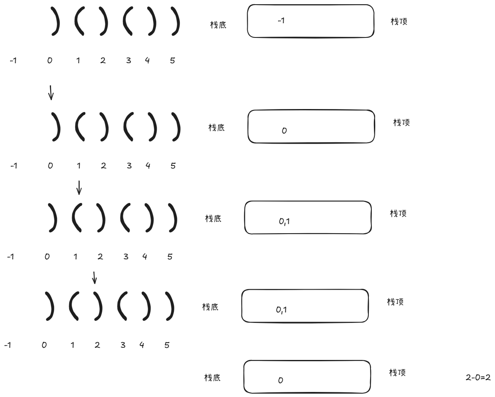

# 32 最长有效括号

如果stack为空 直接push

如果

当前元素

= ( 直接塞进去

= ) 判断下peek的元素是否是(

如果是 则pop 

得到此刻的最大长度为 i-peek

如果不是,继续push

> 更新: 2025-09-26 16:52:30  
> 原文: <https://www.yuque.com/zhangshun-xxqvr/vg2bou/rq6u1n62os0evmhu>