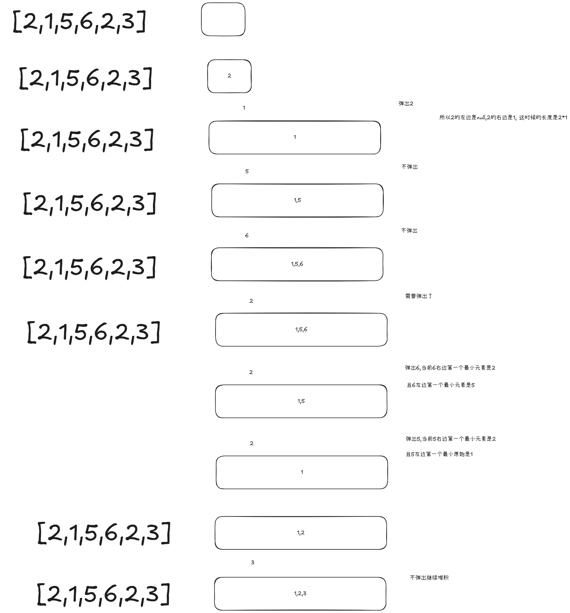

# 84题柱状中中的最大矩形的理解过程




```java
class Solution {
    public int largestRectangleArea(int[] heights) {
        int n = heights.length,max = 0;
        int[] nh = new int[n+2];
        nh[0]=0;
        nh[n+1]=0;
        System.arraycopy(heights,0,nh,1,n);
        Deque<Integer> stack = new ArrayDeque<>();
        for(int i=0;i<nh.length;i++){
            
            while(!stack.isEmpty() && nh[i] < nh[stack.peek()]){
                max = Math.max(max , nh[stack.pop()] * (i - stack.peek() - 1));
            }
            stack.push(i);
        }
        return max;
    }
}
```


```java
class Solution {
    public int largestRectangleArea(int[] heights) {
        int n = heights.length;
        int max = 0;
        int[] newh = new int[n+2];
        newh[0] = 0;
        newh[n+1] = 0;
        System.arraycopy(heights,0,newh,1,n);
        Deque<Integer> stack = new ArrayDeque<>();
        for(int i=0;i<newh.length;i++){
            while(!stack.isEmpty() && newh[i] < newh[stack.peek()]){
                int height = newh[stack.pop()];
                int weight = i - stack.peek() - 1;
                max = Math.max(max,height * weight);
            }
            stack.push(i);
        }
        return max;
    }
}
```


> 更新: 2025-09-23 20:39:55  
> 原文: <https://www.yuque.com/zhangshun-xxqvr/vg2bou/le5dlm8k2enf9cfv>